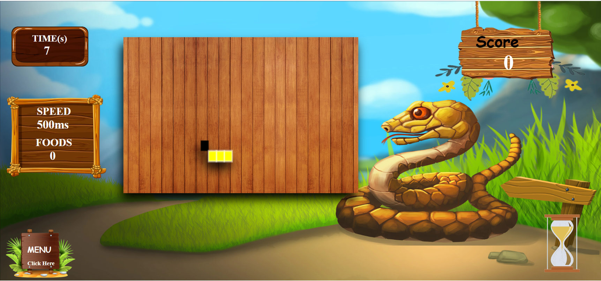

# *About* ❓
**This is my JQuery Snake Game**.

<h3 align="center"></h3>

# *Introduction* 📝
This is a Snake Game created by JQuery CSS and HTML.

# *Objectives* 🔑
* Implement Simple Game Using JQuery

# *Details* 🔖
Below you can see the languages architectures, tools I used  the project.

## Language, Framework and technology
* HTML
* CSS
* JavaScript - JQuery

## Tools
* IntelliJ IDEA